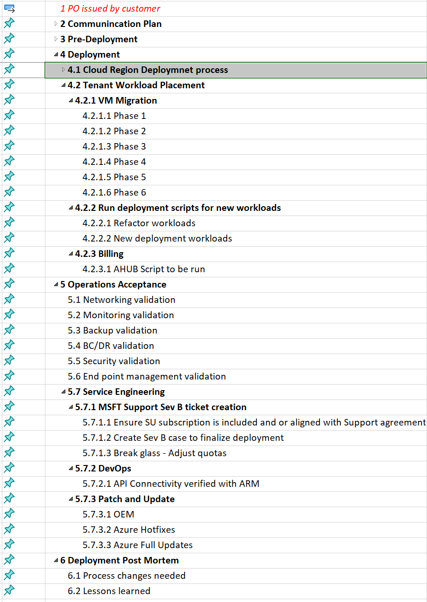

Azure Stack Hub deployments are complex. They require integration into just about every critical component you use to deploy, operate, and monitor your entire technology estate for your business. Once Azure Stack Hub is deployed, the actual meaningful work starts for the Cloud operators and Hybrid engineers...using it to deploy workloads.

In this section of the repository, you will find a project plan framework that a Service Delivery Manger and or Project Manager can use to build out a custom project plan to ensure a successful deployment for their business.

Provided are two file types, a ".mpp" file which is the file format for the desktop version of Project from Microsoft Office. In addition there is a export of the plan in excel format that can be used with other planning software.

The overall project plan in its current version has about 150+ core tasks starting from once the customer issues the purchase order from the OEM of choice.

