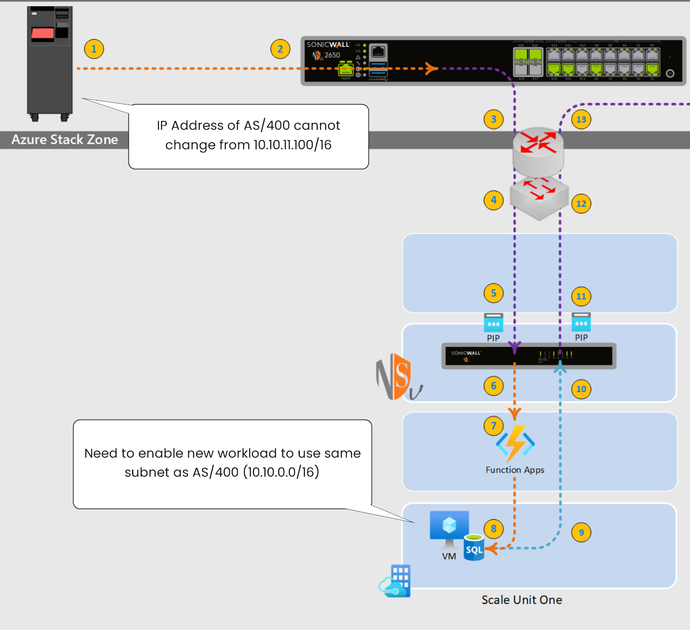

# SonicWall NS*v* on Azure Stack Hub

The SonicWall NS*v* provides enhanced networking between legacy network environments and Azure Stack Hub scale unit deployments.

This reference document details steps to integrate SonicWall appliances in a customers local area network that will establish connectivity from an AS/400 platform to a SQL instance running on Azure Stack Hub.

## Some thoughts on the solution

One of the challenges customers run into during a lift and shift of their data centers is the hidden weight of older, though viable, technologies such as the main frame. What? That green screen thingy my Dad worked on? Yup. Still relevant and hard to replace in some ways. Today's technologies in many ways can effectively replace the main frame when you only focus on the bits and bytes with the speeds and feeds. However, the entrenched technology has in some cases been supporting the business over decades, slowly sipping on the IT budget for decades. Weaving a web through tens of million of dollars or ERP and CRM reporting critical to the financial functions and profitability of the business.

So an assumption that has to be understood here is that the main frame is here to stay for the foreseeable future. This is where a hybrid solution comes into play. 

### Step one - Connectivity from AS/400 to SonicWall appliance

Many legacy technologies or applications cannot readily change their network configuration. In some cases the software license is hard-coded to the IP address or even the mac address of the network interface of the computer. In cases such as these we need to enable the integration using a hybrid architecture.

In the case of Azure Stack Hub (ASH) we need to leverage a Virtual Private Network terminating on the existing local area network (LAN). Transporting that network traffic through the software define network (SDN) of ASH and terminate the traffic onto the Virtual Network (VNET) of the new workload interacting with the AS/400.

#### Reference Point 1 (AS/400) and Point 2 (SonicWall appliance)

##### Working with AS/400

Lets verify the IP address and host name of the AS/400 which will be used to verify and build out our integration efforts.

*Need AS/400 Commands for this section

*Need SonicWall Commands for this section for initial configuration

#### Reference Point 3 (Border Router) and Point 4 (TOR Switch)

*Need most recent info on ASH networking design, ensure to talk about PIP's as that leads into next section

#### Reference Point 5 (Public IP) and Point 6 (SonicWall NS*v*)

*Need info/scripts to deploy a PIP and assign to a resource in ASH

*Need steps to download and side load NSv and configure Peering VPN

*Need steps to configure VPN from NSv to SonicWall appliance in LAN

#### Reference Point 7 (Function) and Point 8 (Linux based SQL)

*Need Python based function to Query AS/400 dataset

*Need CentOS based VM with K8S deployment that we will use to deploy SQL 2019

#### Reference Point 9 (Egress of K8S) through Point 17 (Egress of NSv on second SU)

*Need to focus on detailing (concepts) how to setup peering between the two scale units

#### Reference Point 18 (Ingress to SQL Server) through Point 20 (Web App)

*Need info/scripts on Deploying Web App

#### Reference Point 21 (Ingress to Web App) through Point 26 (Internet user)

*Need some content around Web App insights